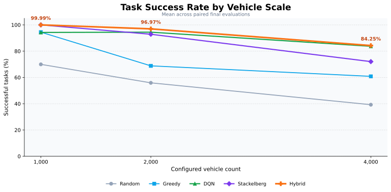
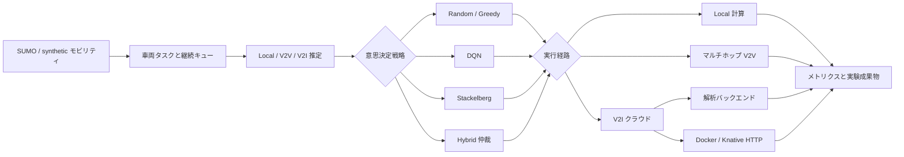

# Serverless Vehicular Task Offloading

[English](README.md) | 日本語

[](https://github.com/zmr2002/vehicular-serverless-offloading/actions/workflows/ci.yml)
[](https://www.python.org/)

車両ネットワークにおける計算オフローディングの再現可能な研究基盤です。SUMO モビリティ、マルチホップ V2V 通信、Deep Q-Network、Stackelberg 型価格決定、Docker／Knative による実サーバーレス実行を統合しています。

卒業論文 *Path Planning and Task Offloading in Serverless Vehicular Networks* の実装として、締切制約のある車両タスクをローカルで処理するか、近隣車両へ委譲するか、クラウドへ送信するかを評価します。

## 特徴

- **Local**、**V2V**、**V2I** の実行経路について、継続的なキュー、無線遅延、消費エネルギー、料金、締切、インフラ容量をモデル化。
- 同一のモビリティとタスク列で Random、Greedy、DQN、Stackelberg、Hybrid Stackelberg-DQN の 5 戦略を比較。
- 学習済み DQN の長期価値と Stackelberg 価格決定、オンラインのゲーム妥当性を組み合わせる分離型 Hybrid 設計。
- 解析型クラウドに加え、Docker Compose または Knative Serving に展開する実 HTTP バックエンドを実装。
- ペア付きマルチシード実験、再開可能な実行、結果来歴の記録、147 件の自動テストを収録。

## 最終結果

最終評価では、3 種類の車両規模で 5 戦略を比較しました。Hybrid はすべての規模で平均タスク成功率が最高となり、低負荷では Stackelberg と同等、中・高負荷でも最高値を維持しました。



| 車両数 | Random | Greedy | DQN | Stackelberg | Hybrid |
| ---: | ---: | ---: | ---: | ---: | ---: |
| 1,000 | 69.96% | 94.46% | 94.24% | 99.99% | **99.99%** |
| 2,000 | 55.89% | 68.82% | 94.45% | 92.86% | **96.97%** |
| 4,000 | 39.25% | 60.82% | 83.70% | 72.04% | **84.25%** |

同じ最終 Hybrid 方策を実際の Knative 閉ループでも検証しました。リプレイと閉ループを合わせて約 **316 万回の HTTP リクエスト**を実行し、解析環境の性能傾向が実バックエンドでも維持されることを確認しました。

| 車両数 | 解析型 Hybrid | Knative 閉ループ | 変化 |
| ---: | ---: | ---: | ---: |
| 1,000 | 99.995% | 99.997% | +0.003 ポイント |
| 2,000 | 97.54% | 98.99% | +1.45 ポイント |
| 4,000 | 84.66% | 84.56% | -0.10 ポイント |

集約結果、ペア比較、実験来歴は [検証済み結果バンドル](results/verified/published/RESULTS.md) に収録しています。

## アーキテクチャ



同一シミュレーションステップ内の全車両は、共通の公開価格とキュー状態から意思決定します。全決定が確定した後に処理をキューへ投入することで、タスク順序による未来の混雑情報の漏えいを防ぎます。DQN のパラメータは共有されますが、各車両は個別に判断し、自身の遅延、エネルギー、料金、完了結果に基づく報酬を受け取ります。

完全なモデルは [アーキテクチャ](docs/architecture.md)、[形式的モデル定義](docs/model-definitions.md)、[分離型 Hybrid](docs/decoupled-hybrid.md) を参照してください。

## 戦略

| 戦略 | 意思決定規則 |
| --- | --- |
| Random | 実行可能な経路からランダムに選択。 |
| Greedy | 推定完了遅延が最小の経路を選択。 |
| DQN | 車両ごとに学習した Local／V2V／V2I 方策。 |
| Stackelberg | クラウドとサービス車両の価格に対するフォロワー応答。 |
| Hybrid | Stackelberg の根拠と DQN の学習価値を適応的仲裁で統合。 |

DQN は経験再生、ターゲットネットワーク、アクションマスク、Double-DQN ターゲット、Huber loss、勾配クリッピングを実装しています。Hybrid は対応する DQN の固定済みチェックポイントを再利用するため、DQN ベースラインとの差は、別途選択したニューラルネットワークではなくゲーム理論に基づく価格決定と仲裁層から生じます。

## クイックスタート

Python 3.11 が必要です。

```bash
python -m venv .venv
python -m pip install --upgrade pip
python -m pip install -e ".[dev]"
python -m unittest discover -s tests -v
```

決定的な synthetic シミュレーションを実行します。

```bash
python -m vehicular_offloading simulate --config configs/smoke.toml
```

Docker Compose でシミュレータと HTTP タスク関数を実行します。

```bash
docker compose up --build --abort-on-container-exit
```

## 最終実験の再現

フル実験を開始せずに最終設定を検証します。

```powershell
.\scripts\run-final-v2.ps1 -DryRun
```

最終解析実験を実行、または途中から再開します。

```powershell
.\scripts\run-final-v2.ps1
```

ローカルの Knative 環境で最終 Hybrid を検証します。

```powershell
.\scripts\run-final-v2-knative-validation.ps1 -PreflightOnly
.\scripts\run-final-v2-knative-validation.ps1
```

解析実験と実 Knative 検証は異なる目的を持ちます。解析行列は制御された条件で戦略を比較し、Knative 検証は展開忠実度、HTTP オーバーヘッド、コールドスタート、リトライ、オートスケーリングを測定します。

## リポジトリ構成

```text
.
|-- configs/                       # シミュレーション・実験設定
|-- deploy/knative/                # Knative Service 定義
|-- docs/                          # アーキテクチャ・モデル文書
|-- results/verified/published/    # 検証済み結果バンドル
|-- scenarios/wakaba/              # SUMO 道路ネットワーク
|-- scripts/                       # 実験・デプロイ実行スクリプト
|-- serverless_function/           # コンテナ化 HTTP タスク関数
|-- src/vehicular_offloading/      # シミュレータ、方策、メトリクス、CLI
`-- tests/                         # 自動テスト
```

## ドキュメント

- [検証済み結果](results/verified/published/RESULTS.md)
- [実験カタログ](docs/experiment-catalog.md)
- [アーキテクチャ](docs/architecture.md)
- [形式的モデル定義](docs/model-definitions.md)
- [分離型 Hybrid](docs/decoupled-hybrid.md)
- [適応的仲裁](docs/hybrid-adaptive-arbitration.md)
- [再現性プロトコル](docs/reproducibility.md)

## 技術スタック

Python 3.11 · PyTorch · NumPy · SciPy · Eclipse SUMO · Flask · Docker Compose · Knative Serving · Minikube
