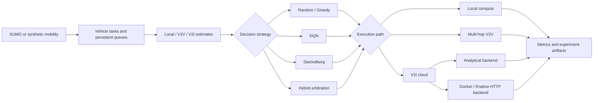

# Serverless Vehicular Task Offloading

English | [日本語](README.ja.md)

[](https://github.com/zmr2002/vehicular-serverless-offloading/actions/workflows/ci.yml)
[](https://www.python.org/)

A reproducible research platform for computation offloading in vehicular networks. It combines SUMO mobility, multi-hop V2V communication, Deep Q-Networks, Stackelberg pricing, and real Docker/Knative serverless execution.

Developed as the implementation of the graduation thesis *Path Planning and Task Offloading in Serverless Vehicular Networks*, the system studies how deadline-sensitive vehicle tasks should be executed locally, delegated to nearby vehicles, or sent to cloud infrastructure.

## Highlights

- Models **Local**, **V2V**, and **V2I** execution with persistent queues, wireless delay, energy use, payment, deadlines, and infrastructure capacity.
- Compares five strategies under identical mobility and task streams: Random, Greedy, DQN, Stackelberg, and Hybrid Stackelberg-DQN.
- Uses a decoupled Hybrid design: a frozen DQN policy provides learned long-term value, while Stackelberg pricing and online game-adequacy evidence arbitrate the final per-vehicle decision.
- Supports analytical cloud execution and a real HTTP backend deployed with Docker Compose or Knative Serving.
- Includes paired multi-seed experiment runners, resumable execution, compact result provenance, and 147 automated tests.

## Final results

The final paired evaluation compares all five strategies at three vehicle scales. Hybrid achieved the highest mean task-success rate at every scale, tying Stackelberg under light load and remaining highest as load increased.


| Vehicles | Random | Greedy | DQN | Stackelberg | Hybrid |
| ---: | ---: | ---: | ---: | ---: | ---: |
| 1,000 | 69.96% | 94.46% | 94.24% | 99.99% | **99.99%** |
| 2,000 | 55.89% | 68.82% | 94.45% | 92.86% | **96.97%** |
| 4,000 | 39.25% | 60.82% | 83.70% | 72.04% | **84.25%** |

The same final Hybrid policies were then validated through a real Knative closed loop. Across approximately **3.16 million HTTP requests**, the live backend preserved the analytical result profile:

| Vehicles | Analytical Hybrid | Knative closed loop | Change |
| ---: | ---: | ---: | ---: |
| 1,000 | 99.995% | 99.997% | +0.003 pp |
| 2,000 | 97.54% | 98.99% | +1.45 pp |
| 4,000 | 84.66% | 84.56% | -0.10 pp |

Full aggregates, paired comparisons, and provenance are available in [the verified result bundle](results/verified/published/RESULTS.md).

## Architecture



All vehicles in a simulation step decide from the same published price and queue snapshot. Work is admitted only after decisions are fixed, preventing task ordering from leaking future congestion information. DQN parameters are shared, but each vehicle makes its own decision and receives its own delay, energy, payment, and completion reward.

See [Architecture](docs/architecture.md), [Formal model definitions](docs/model-definitions.md), and [Decoupled Hybrid](docs/decoupled-hybrid.md) for the complete model.

## Strategies

| Strategy | Decision rule |
| --- | --- |
| Random | Random feasible execution path. |
| Greedy | Path with the lowest estimated completion delay. |
| DQN | Learned per-vehicle Local/V2V/V2I policy. |
| Stackelberg | Follower response to capacity-aware cloud and service-vehicle pricing. |
| Hybrid | Stackelberg evidence and learned DQN value combined through adaptive arbitration. |

The DQN implementation includes experience replay, a target network, action masking, Double-DQN targets, Huber loss, and gradient clipping. The Hybrid reuses the corresponding frozen DQN checkpoint, so its difference from the DQN baseline comes from the game-theoretic pricing and arbitration layer rather than a separately selected neural network.

## Quick start

Python 3.11 is required.

```bash
python -m venv .venv
python -m pip install --upgrade pip
python -m pip install -e ".[dev]"
python -m unittest discover -s tests -v
```

Run a deterministic synthetic simulation:

```bash
python -m vehicular_offloading simulate --config configs/smoke.toml
```

Run the simulator and HTTP task function with Docker Compose:

```bash
docker compose up --build --abort-on-container-exit
```

## Reproducing the final study

Validate the final experiment configuration without starting the full matrix:

```powershell
.\scripts\run-final-v2.ps1 -DryRun
```

Run or resume the final analytical study:

```powershell
.\scripts\run-final-v2.ps1
```

Validate the final Hybrid against a local Knative deployment:

```powershell
.\scripts\run-final-v2-knative-validation.ps1 -PreflightOnly
.\scripts\run-final-v2-knative-validation.ps1
```

The analytical study and live Knative validation answer different questions: the analytical matrix compares strategies under controlled conditions, while the Knative study measures deployment fidelity, HTTP overhead, cold starts, retries, and autoscaling behavior.

## Repository structure

```text
.
|-- configs/                       # Simulation and experiment profiles
|-- deploy/knative/                # Knative Service definition
|-- docs/                          # Architecture and model documentation
|-- results/verified/published/    # Compact verified result bundle
|-- scenarios/wakaba/              # SUMO road network
|-- scripts/                       # Experiment and deployment runners
|-- serverless_function/           # Containerized HTTP task function
|-- src/vehicular_offloading/      # Simulator, policies, metrics, and CLI
`-- tests/                         # Automated test suite
```

## Documentation

- [Verified results](results/verified/published/RESULTS.md)
- [Experiment catalog](docs/experiment-catalog.md)
- [Architecture](docs/architecture.md)
- [Formal model definitions](docs/model-definitions.md)
- [Decoupled Hybrid](docs/decoupled-hybrid.md)
- [Adaptive arbitration](docs/hybrid-adaptive-arbitration.md)
- [Reproducibility protocol](docs/reproducibility.md)

## Technology stack

Python 3.11 · PyTorch · NumPy · SciPy · Eclipse SUMO · Flask · Docker Compose · Knative Serving · Minikube
